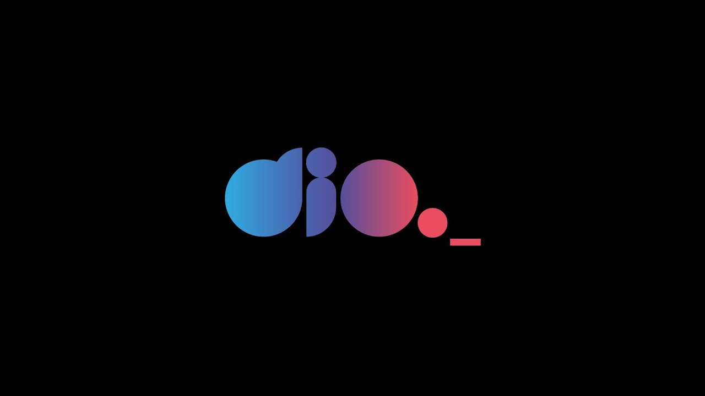

<h1 align="center">DIO - Classes de um Jogo</h1>



## 💻 Projeto

Este projeto foi um desafio do Bootcamp GFT Start #6 - Lógica de Programação na DIO. O desafio consistia em criar uma classe genérica que representasse um heroi, que tivesse as propriedades nome, idade e tipo. Além disso, os objetos dessa classe tem um método atacar, que imprimiria uma mensagem de ataque baseado na classe dele:
- Se mago -> Mago atacou usando magia.
- Se guerreiro -> Guerreiro atacou usando espada.
- Se monge -> Monge atacou usando artes marciais.
- Se ninja -> Ninja atacou usando shuriken.

## 👨‍💻 Resolução do Desafio

Para este desafio, utilizei a linguagem JavaScript, e resolvi ele em alguns passos:

1 - Criei a classe `Hero` e coloquei no constructor os parâmetros `name`, `age` e `type`
```
class Hero {
    constructor(name, age, type) {
        this.name = name;
        this.age = age;
        this.type = type
    }
}
```

2 - Criei o método `attack()` dentro da classe `Hero`
```
attack(){
        if (this.type.toLowerCase() === "mago") {
            return `${this.type} atacou usando magia!`
        } 

        if (this.type.toLowerCase() === "guerreiro") {
            return `${this.type} atacou usando espada!`
        }

        if (this.type.toLowerCase() === "monge") {
            return `${this.type} atacou usando artes maciais!`
        }

        return `${this.type} atacou usando shuriken!`
    }
```
Utilizei o conceito de early return na escrita das condicionais para deixar o código mais limpo e manutenível. Além disso, utilizei `toLowerCase()` nas condições para garantir que escrever a classe tanto com inicial maiúscula ou minúscula fizessem o código funcionar.

3 - Instanciei dois objetos com tipos `Mago` e `Guerreiro` e imprimi eles e seus métodos para testar.
```
const mago = new Hero("Lucildo", 20, "Mago")
const guerreiro = new Hero("João", 24, "guerreiro")

console.log(mago.attack())
console.log(guerreiro.attack())
console.log(mago)
console.log(guerreiro)
```


Resolver esse desafio ajudou a reforçar e consolidar meus conhecimentos em lógica de programação. Gratidão ao professor Felipe e a DIO e a GFT pelo bootcamp.
